<p align="center">
  
</p>

<p align="center">
  <a href="https://nongnghiepxanh.site">
    
  </a>
  &nbsp;
  <a href="https://hoccungai.site">
    
  </a>
  &nbsp;
  <a href="https://github.com/apexuankhoi?tab=followers">
    
  </a>
</p>

<p align="center">
  <samp>
    I turn ideas into responsive, useful and thoughtfully crafted digital products.
  </samp>
</p>

<br />

## `01.` A little about me

```javascript
const khoi = {
  location: "Hanoi, Vietnam 🇻🇳",
  education: "Information Technology @ Đại Nam University",
  focus: ["Frontend Development", "Web Applications", "Mobile Apps"],
  currentlyLearning: ["React", "React Native", "Node.js", "SQL"],
  openTo: ["Internships", "Freelance Projects", "Remote Opportunities"],
  motto: "Learn deeply. Build simply. Ship proudly."
};
```

I enjoy the space where **clean interface design** meets **practical engineering**. My goal is not only to make things look good, but to make every interaction feel clear, fast and natural.

<br />

## `02.` My toolbox

<p align="center">
  
</p>

<div align="center">

| Frontend | Backend & Data | Workflow |
| :---: | :---: | :---: |
| `HTML` · `CSS` · `JavaScript` · `TypeScript` · `React` | `Node.js` · `MySQL` · `MongoDB` · `REST APIs` | `Git` · `GitHub` · `Figma` · `Postman` |

</div>

<br />

## `03.` Selected work

<table>
  <tr>
    <td width="50%" valign="top">
      <h3 align="center">🍱 Bếp Look</h3>
      <p align="center"><strong>Good food deserves a second chance.</strong></p>
      <p>
        A web and mobile food-rescue platform connecting individuals and businesses
        with surplus food to people who need it.
      </p>
      <p><strong>Highlights</strong></p>
      <ul>
        <li>Recipient, donor, business and admin experiences</li>
        <li>Authentication and role-based access</li>
        <li>Location-aware discovery and booking</li>
        <li>Reputation, reporting and direct chat flows</li>
      </ul>
      <p align="center">
        
        
        
      </p>
      <p align="center">
        <a href="https://github.com/apexuankhoi/BepLook">
          
        </a>
      </p>
    </td>
    <td width="50%" valign="top">
      <h3 align="center">🎓 EduCheck</h3>
      <p align="center"><strong>A smarter campus, in one platform.</strong></p>
      <p>
        A cross-platform education management system for students, teachers,
        administrators and everyday academic operations.
      </p>
      <p><strong>Highlights</strong></p>
      <ul>
        <li>Camera and GPS-assisted attendance</li>
        <li>Role-specific learning dashboards</li>
        <li>Classes, assignments, scores and schedules</li>
        <li>Notifications and learning materials</li>
      </ul>
      <p align="center">
        
        
        
      </p>
      <p align="center">
        <a href="https://github.com/apexuankhoi/DNU-">
          
        </a>
      </p>
    </td>
  </tr>
  <tr>
    <td width="50%" valign="top">
      <h3 align="center">🌱 Nông Nghiệp Xanh</h3>
      <p align="center"><strong>Practical knowledge for greener farming.</strong></p>
      <p>
        An accessible agricultural knowledge hub sharing farming techniques and
        useful resources with rural communities.
      </p>
      <p><strong>Highlights</strong></p>
      <ul>
        <li>Structured agricultural article library</li>
        <li>Simple content discovery</li>
        <li>Responsive, mobile-friendly interface</li>
      </ul>
      <p align="center">
        
        
        
      </p>
      <p align="center">
        <a href="https://nongnghiepxanh.site">
          
        </a>
      </p>
    </td>
    <td width="50%" valign="top">
      <h3 align="center">🤖 Học Cùng AI</h3>
      <p align="center"><strong>Making AI easier to learn and explore.</strong></p>
      <p>
        An educational experience helping learners discover AI tools, concepts and
        practical ways to use them.
      </p>
      <p><strong>Highlights</strong></p>
      <ul>
        <li>Curated AI learning resources</li>
        <li>Friendly, modern content experience</li>
        <li>Cross-device responsive design</li>
      </ul>
      <p align="center">
        
        
        
        
      </p>
      <p align="center">
        <a href="https://hoccungai.site">
          
        </a>
      </p>
    </td>
  </tr>
</table>

<br />

## `04.` GitHub pulse

<p align="center">
  
</p>

<p align="center">
  
  
</p>

<p align="center">
  <picture>
    <source media="(prefers-color-scheme: dark)" srcset="https://raw.githubusercontent.com/apexuankhoi/apexuankhoi/output/github-contribution-grid-snake-dark.svg" />
    <source media="(prefers-color-scheme: light)" srcset="https://raw.githubusercontent.com/apexuankhoi/apexuankhoi/output/github-contribution-grid-snake.svg" />
    
  </picture>
</p>

<br />

## `05.` What I care about

<table>
  <tr>
    <td align="center" width="33%">
      <h3>⚡</h3>
      <strong>Fast by default</strong>
      <br /><br />
      <sub>Responsive interfaces that feel quick on every screen.</sub>
    </td>
    <td align="center" width="33%">
      <h3>🧭</h3>
      <strong>Clear experiences</strong>
      <br /><br />
      <sub>Simple flows, thoughtful details and less user friction.</sub>
    </td>
    <td align="center" width="33%">
      <h3>🌱</h3>
      <strong>Useful outcomes</strong>
      <br /><br />
      <sub>Technology that solves a real problem for real people.</sub>
    </td>
  </tr>
</table>

<br />

## `06.` Let's create something meaningful

I'm currently open to **internships, freelance projects and remote collaborations**. If you are building something useful and care about the details, I would love to hear about it.

<p align="center">
  <a href="https://github.com/apexuankhoi">
    
  </a>
</p>

<p align="center">
  
</p>
